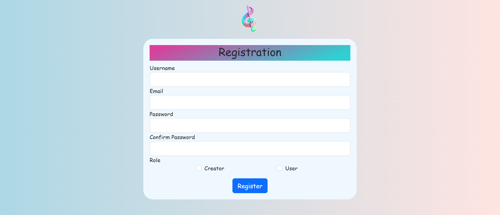
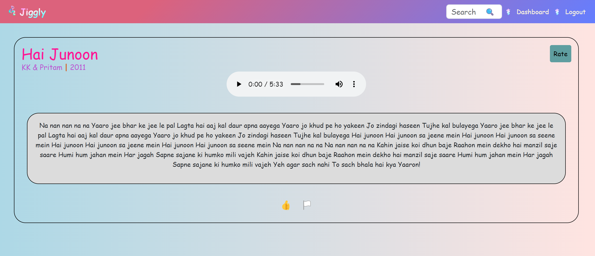

# Jiggly Music App
I developed ‘Jiggly’, a multi-user web application, as part of my App Development-2 project. This was during my time pursuing a Diploma in Programming, which is a part of the B.S. degree in Data Science & Applications offered by IIT-Madras.
For a more detailed understanding of the project, I encourage you to view the [Project Report](https://drive.google.com/file/d/1NKqv9D8skraXLpWExnjb1Mrxk15qXh6d/view?usp=sharing).

## App Screenshots
• Home Page

• User/Creator Registration Page

• User/Creator Login Page (similar page exists for Admin Login)

• User Dashboard

• Song Details

• All Songs

• Page for creating new playlist (similar page exits to edit playlist & create new/edit album which is for Creator role)

•  PLaylist Page (for user & similar page exists for Album)

•  User/Creator profile page

• Creator Dashboard

• Upload Song (similar page exists for editig song)

• Admin Dashboard

• Admin Tracks

• Admin Creators

• Admin Albums

• MailHog

• Daily Reminder (for User)

• Monthly Report (for Creator)

